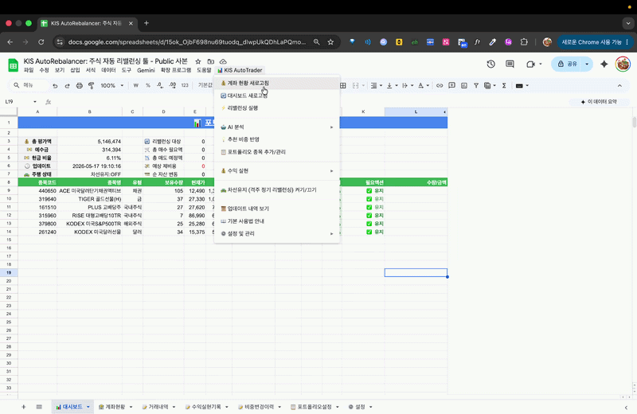

# KIS AutoRebalancer

**한국투자증권(KIS) Open API**를 활용하여 구글 스프레드시트에서 주식 포트폴리오를 관리하고 자동 리밸런싱을 수행하는 **Google Apps Script(GAS)** 프로젝트입니다.


---

## 💡 이 프로젝트를 만든 이유

포트폴리오 비중을 구글 시트로 관리하면서 **직접 MTS(모바일 트레이딩 앱)를 열고 종목 하나씩 매수/매도해야 하는 불편함**을 해결하고자 만들었습니다.

리밸런싱이 필요한 시점을 시트에서 확인하고, 다시 MTS로 이동해 하나씩 주문을 넣는 과정이 반복되는 것이 핵심 불편함이었습니다. 이 프로젝트는 그 과정을 **구글 시트 안에서 클릭 한 번으로 끝낼 수 있도록** 자동화한 것입니다.

### 📚 기본 포트폴리오 출처

기본 예시 포트폴리오는 **"한 번 배워서 평생 써먹는 박곰희 투자법"** 에서 소개된 자산 배분 방식을 참고하여 구성되었습니다. 국내주식·해외주식·채권·금·달러·현금을 분산하는 방어적 포트폴리오 구조입니다.

### 🎬 영감을 받은 콘텐츠

- [주식부엉 — 구글 시트 포트폴리오 리밸런싱 툴](https://www.youtube.com/watch?v=PRJBolYCSmU&t=3s): 구글 시트 기반으로 리밸런싱을 자동화할 수 있다는 아이디어를 얻었습니다.
- [박곰희 — 포트폴리오 리밸런싱 방법](https://youtu.be/LL2gKLMLCgk?si=QY7gwuwHcMhjixQs): 자산 배분과 리밸런싱 실천 방법에서 영감을 받았습니다.

---

> [!WARNING]
> **이 도구는 리밸런싱과 자산 배분 포트폴리오 투자에 대한 기본 개념을 이미 이해하고 있는 분을 대상으로 합니다.**
> 개념 없이 사용하면 의도치 않은 자동 매매가 발생할 수 있습니다. 반드시 모의투자로 충분히 테스트한 후 실전에 적용하세요.

---

## 🚀 주요 기능



- **📊 통합 대시보드**: 실시간 자산 모니터링 (총 평가액, 예수금, 수익률). 목표 포트폴리오 대비 현재 비중 비교 및 매수/매도 신호 자동 계산.
- **⚡ 리밸런싱 실행**: 대시보드에서 계산된 매수/매도 주문을 버튼 한 번으로 일괄 실행. 매도 우선 순위 전략(현금 확보 후 매수)으로 안전하게 진행.
- **🛣️ 주간 자동 리밸런싱**: 매주 월요일 오전 10시, 포트폴리오 비중을 자동으로 점검하고 리밸런싱 실행.
- **💰 수익 실현**: 목표 수익률 기반 안전 인출 금액 계산. 포트폴리오 비율을 유지하며 수익을 실현하는 자동 매도 계획 생성.
- **🛡️ 보안 강화**: API Key 등 민감한 정보를 `UserProperties`에 안전하게 저장. 시트별 설정 격리로 여러 계좌 관리 가능.
- **📝 거래 내역 기록**: 실행된 모든 주문이 `📝 거래내역` 시트에 자동 저장.
- **🔢 수수료/세금 반영**: 매수/매도 제비용을 계산에 포함하여 정확한 가용 현금 산출. ISA 계좌 여부에 따른 수수료율 별도 설정 지원.

## 📂 파일 구조

```
kis_auto_rebalance/
├── container/
│   └── code.gs          # 구글 시트에 직접 붙여넣는 컨테이너 스크립트
└── kis_library_public/  # GAS 라이브러리 (Script ID로 추가)
    ├── core/
    │   ├── KISClient.js     # 한국투자증권 REST API 통신 모듈
    │   ├── config.js        # 환경 설정 및 토큰 관리
    │   └── code.js          # 포트폴리오 조회, 자동 리밸런싱 트리거
    ├── features/
    │   ├── Dashboard.js     # 리밸런싱 대시보드 UI 및 주문 실행
    │   ├── Withdraw.js      # 수익 실현 및 인출 계획
    │   └── SecureConfig.js  # API 키 보안 저장 관리
    └── utils/
        ├── Menu.js          # 구글 시트 상단 메뉴 구성
        ├── SheetManager.js  # 시트 초기화 및 렌더링 유틸리티
        └── UsageGuide.js    # 사용법 안내
```

## ⚙️ 설치 방법

### 1. 구글 시트 템플릿 복사
아래 링크를 클릭하여 템플릿 시트의 사본을 만듭니다. **앱 스크립트 코드와 라이브러리 설정이 이미 포함되어 있어 즉시 사용 가능합니다.**

- **[📊 KIS Auto-Rebalancer 템플릿 복사하기](https://docs.google.com/spreadsheets/d/1w9oa8QCMpg9BxVuV86HA6gnho1j_IphSBOdH7zc2Hj8/copy)**

> [!TIP]
> 템플릿을 복사했다면 아래 '2. 라이브러리 및 스크립트 수동 설치' 과정은 건너뛰고 바로 **[3. 초기 설정 실행](#3-초기-설정-실행)**으로 이동하세요.

### 2. 라이브러리 및 스크립트 수동 설치 (선택 사항)
직접 만든 시트에 설치하고 싶은 경우에만 아래 과정을 진행합니다.

1. **라이브러리 추가**: `확장 프로그램 > Apps Script > 라이브러리(+)`에서 아래 Script ID를 입력 (버전: `HEAD`, 식별자: `KIS`)
   - `1LXA06wO7XtQmqqZ4GdnFm6w4bwzl8nrG5dhcE2qc6h0WFcxtxj-OFoc6`
2. **컨테이너 스크립트**: `container/code.gs` 내용을 복사하여 앱 스크립트 편집기에 붙여넣기

### 3. 초기 설정 실행
1. 구글 시트를 새로고침하면 상단에 `📊 KIS AutoTrader` 메뉴가 생깁니다.
2. `⚙️ 설정 및 관리 > ⚙️ 초기 설정`을 실행하여 필요한 시트 구조를 생성합니다.
3. `🛡️ API 키 보안 설정`에서 한국투자증권 API 키와 Gemini API 키를 입력합니다.

### 4. 포트폴리오 설정
`📋 포트폴리오설정` 시트에서 종목코드, 종목명, 목표비율(%)을 수정합니다. 기본 예시 포트폴리오가 제공됩니다.

---

> [!NOTE]
> **개발자 참고 (clasp)**: 라이브러리 방식 대신 직접 소스 코드를 배포하고 싶다면 `kis_library_public` 폴더에서 `clasp push`를 사용할 수 있습니다.

## 🛣️ 자동 리밸런싱 설정

### 1. 주간 자동 리밸런싱 (차선 유지)
메뉴에서 `🛣️ 주간 자동 리밸런싱 활성/비활성`을 클릭하여 켜고 끌 수 있습니다.
- **실행 시간**: 매주 월요일 오전 10시
- **중복 방지**: 13일 이내에 이미 실행된 이력이 있으면 자동으로 스킵하여 과도한 거래를 방지합니다.
- **임계치**: 설정 시트의 '리밸런싱 임계치(%)'보다 비중 차이가 적은 종목은 주문을 생성하지 않습니다.

### 2. 시스템 자동화 트리거
이 프로젝트는 아래와 같은 Google Apps Script 트리거를 활용합니다.
- **onOpen (열기 시)**: 시트를 열 때마다 `automatedRefreshRoutine`이 실행되어 최신 계좌 현황과 대시보드를 즉시 새로고침합니다.
- **Time-driven (시간 기반)**: 사용자가 메뉴를 통해 활성화할 때만 매주 월요일 예약 주문 트리거가 생성됩니다.

---

## 🛡️ 보안 및 개인정보 보호 (작동 원리)

이 프로젝트는 사용자의 민감한 금융 정보를 안전하게 보호하기 위해 아래와 같은 메커니즘을 사용합니다.

### 1. UserProperties 활용 (개인별 격리)
API Key, Secret, 계좌번호 등은 구글 시트의 셀에 저장되지 않고 구글 앱 스크립트의 **`UserProperties`** 저장소에 보관됩니다.
- **철저한 보안**: 이 저장소는 오직 입력한 본인만 읽고 쓸 수 있습니다.
- **공유 시 안전**: 시트를 다른 사람과 공유하더라도, 공유받은 사람은 본인의 저장소를 사용하게 되므로 원본 사용자의 키 정보는 절대 노출되지 않습니다.

### 2. 시트별 설정 격리 (Spreadsheet ID Prefix)
동일한 구글 계정으로 여러 개의 계좌를 관리하더라도 설정이 섞이지 않도록 **시트 고유 ID**를 키값의 접두어로 사용합니다.
- 예: `[시트_A_ID]_KIS_APP_KEY`, `[시트_B_ID]_KIS_APP_KEY` 형태로 각각 독립적으로 저장됩니다.

---

## 🔧 기술 스택

- **플랫폼**: Google Apps Script (V8 런타임)
- **인터페이스**: Google Sheets (커스텀 메뉴, HTML 다이얼로그)
- **API**: 한국투자증권 Open API
- **배포**: clasp

## 📖 기본 사용법

### 1. 초기 설정

| 단계 | 방법 |
|------|------|
| 필수 시트 생성 | 메뉴 `⚙️ 설정 및 관리 > ⚙️ 초기 설정` 실행 → 대시보드, 계좌현황, 포트폴리오설정, 거래내역 시트 자동 생성 |
| API 키 입력 | `🛡️ API 키 보안 설정` 창에서 한국투자증권 APP KEY, APP SECRET, 계좌번호, Gemini API 키 입력. 모두 암호화 보관됩니다. |
| 기본 설정 확인 | `⚙️ 설정` 시트에서 계좌 종류(일반/ISA/모의), 리밸런싱 임계치(%), 수익실현 임계치(%) 확인 및 수정 |

---

### 2. 포트폴리오 비중 설정

`📋 포트폴리오설정` 시트는 아래 두 가지 비율 열로 구성됩니다.

| 열 | 이름 | 역할 |
|----|------|------|
| C열 | **기준비율(%)** | 처음 설정한 고정 목표 비중. 기준점 역할. |
| D열 | **운용비율(%)** | 실제 리밸런싱에 사용. AI 제안 또는 수동으로 조정 가능. |

- **종목 추가/관리**: 메뉴 `📋 포트폴리오 종목 추가/관리`에서 종목코드로 이름을 검색하고 비중을 입력합니다.
- 운용비율(D열) 합계가 **100%**가 되도록 설정하세요.

---

### 3. 리밸런싱 실행

- **⚡ 수동 리밸런싱**: 메뉴 `리밸런싱 실행` → 운용비율(D열) 기준으로 초과 종목은 매도, 부족 종목은 매수
- **🛣️ 차선 유지 (격주 자동 리밸런싱)**: `차선유지 켜기/끄기` ON → 매주 월요일 오전 10시 자동 실행. 마지막 실행 후 13일 이내이면 자동 스킵(격주 효과)
- **임계치**: 현재 비중과 운용비율 차이가 설정값(%p) 이상일 때만 주문 발생 (기본 2%p)
- **매도 우선**: 초과 종목 매도 → 현금 확보 → 부족 종목 매수 순서로 진행
- **수수료 자동 반영**: ETF 기준 매수/매도 수수료 0.015%가 계산에 포함

---

### 4. AI 비중 제안 및 반영

- **📊 AI 비중 제안**: 메뉴 `🤖 AI 분석 > AI 비중 제안` → 현재 시장 상황 분석 후 "현재 비중 ➡️ 조정 비중" 형태로 제안. 결과는 `비중변경이력` 시트에 자동 저장
- **💡 추천 비중 반영**: `추천 비중 반영` 메뉴 → 비중변경이력의 최신 AI 추천을 운용비율(D열)에 일괄 적용. 적용 후 **14일간 재변경 제한**
- **💬 AI 빠른 질문**: 포트폴리오와 무관한 시장·경제 궁금증을 바로 AI에게 질문
- **⚙️ AI 프롬프트 상세 설정**: AI 분석 시 참고하는 시스템 프롬프트를 직접 수정 가능

---

### 5. 수익 실현

- 메뉴 `💰 수익 실현 > 수익 실현 창 열기` → 원하는 금액 입력 → 보유 비중에 비례해 종목별 매도 수량 자동 계산·실행
- 매도 후 인출 예정 금액은 **2주간 예수금 보호** 처리 → 리밸런싱 시 재매수 방지

---

## ⚠️ 주의사항

- **실전 투자**: 자동 리밸런싱은 **실제 돈으로 자동 매매**가 일어납니다. 반드시 모의투자로 충분히 테스트하고 본인의 책임하에 사용하세요.
- **모의투자 설정**: `⚙️ 설정` 시트의 `모의투자` 항목을 `TRUE`로 설정하면 실제 주문 없이 테스트할 수 있습니다.
- **KIS Open API**: [한국투자증권 오픈 API](https://apiportal.koreainvestment.com)에서 발급받은 AppKey/AppSecret이 필요합니다.

## 🔮 추후 방향

현재는 주간 자동 리밸런싱(차선 유지) 수준이지만, 앞으로 AI가 시장 상황을 분석해 비중 자체를 자동으로 조정하는 방향을 고민 중입니다. 단순히 정해진 비율로 맞추는 것을 넘어, 기술적 지표와 시장 뉴스를 종합해 리밸런싱 강도와 비중 배분까지 AI가 판단하는 자율 운용 형태가 목표입니다.

## 📋 라이선스

MIT License
